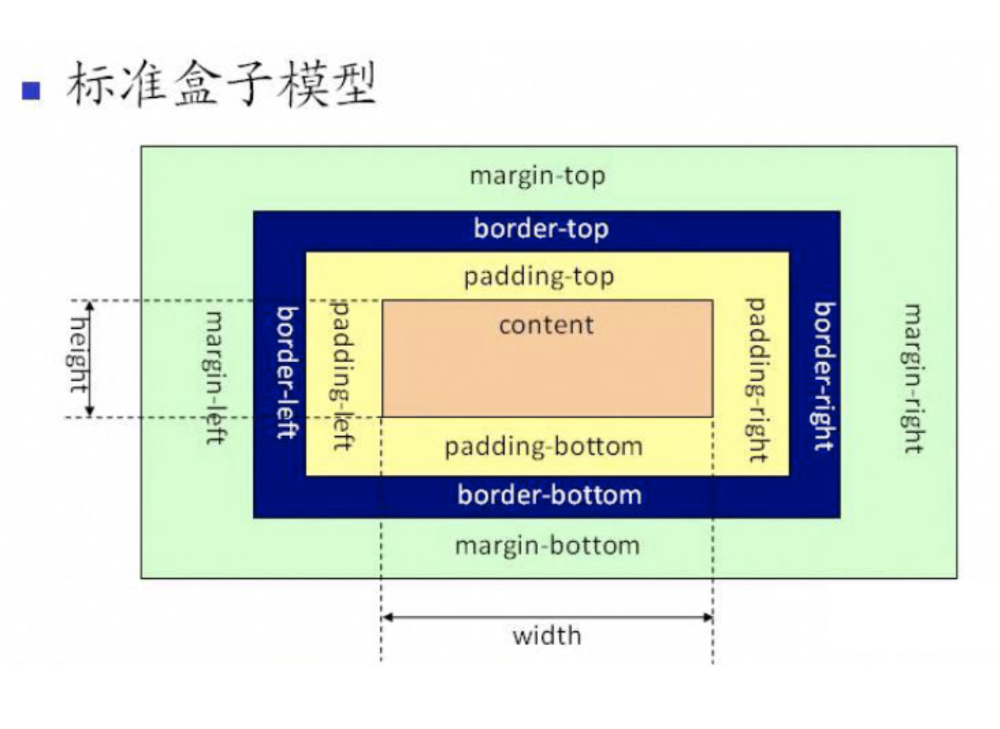
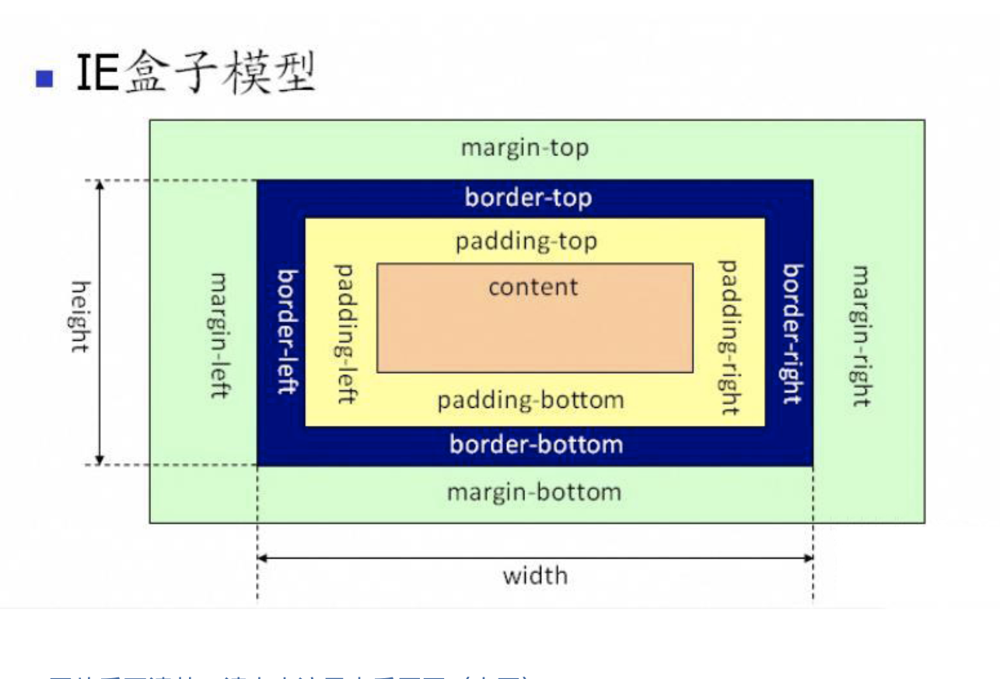

# 盒子模型

CSS 基础框盒模型介绍
当对一个文档进行布局（lay out）的时候，浏览器的渲染引擎会根据标准之一的 CSS 基础框盒模型（CSS basic box model），将所有元素表示为一个个矩形的盒子（box）。CSS 决定这些盒子的大小、位置以及属性（例如颜色、背景、边框尺寸…）。

每个盒子由四个部分（或称区域）组成，其效用由它们各自的边界（Edge）所定义（原文：defined by their respective edges，可能意指容纳、包含、限制等）。如图，与盒子的四个组成区域相对应，每个盒子有四个边界：内容边界 Content edge、内边距边界 Padding Edge、边框边界 Border Edge、外边框边界 Margin Edge。


内容区域 content area ，由内容边界限制，容纳着元素的“真实”内容，例如文本、图像，或是一个视频播放器。它的尺寸为内容宽度（或称 content-box 宽度）和内容高度（或称 content-box 高度）。它通常含有一个背景颜色（默认颜色为透明）或背景图像。
如果 box-sizing 为 content-box（默认），则内容区域的大小可明确地通过 width、min-width、max-width、height、min-height，和 max-height 控制。

内边距区域 padding area 由内边距边界限制，扩展自内容区域，负责延伸内容区域的背景，填充元素中内容与边框的间距。它的尺寸是 padding-box 宽度 和 padding-box 高度。
内边距的粗细可以由 padding-top、padding-right、padding-bottom、padding-left，和简写属性 padding 控制。

边框区域 border area 由边框边界限制，扩展自内边距区域，是容纳边框的区域。其尺寸为 border-box  宽度 和 border-box 高度。
边框的粗细由 border-width 和简写的 border 属性控制。如果 box-sizing 属性被设为 border-box，那么边框区域的大小可明确地通过 width、min-width, max-width、height、min-height，和 max-height 属性控制。假如框盒上设有背景（background-color 或 background-image），背景将会一直延伸至边框的外沿（默认为在边框下层延伸，边框会盖在背景上）。此默认表现可通过 CSS 属性 background-clip 来改变。

外边距区域 margin area 由外边距边界限制，用空白区域扩展边框区域，以分开相邻的元素。它的尺寸为 margin-box 宽度 和 margin-box 高度。

盒子模型有两种模型：标准盒子模型 、 IE盒子模型;

content-box:
默认值，标准盒子模型。 width 与 height 只包括内容的宽和高， 不包括边框（border），内边距（padding），外边距（margin）。注意: 内边距、边框和外边距都在这个盒子的外部。 比如说，.box {width: 350px; border: 10px solid black;} 在浏览器中的渲染的实际宽度将是 370px。

尺寸计算公式：
width = 内容的宽度
height = 内容的高度
宽度和高度的计算值都不包含内容的边框（border）和内边距（padding）。

border-box: 
width 和 height 属性包括内容，内边距和边框，但不包括外边距。这是当文档处于 Quirks模式 时Internet Explorer使用的盒模型。注意，填充和边框将在盒子内 , 例如, .box {width: 350px; border: 10px solid black;} 导致在浏览器中呈现的宽度为350px的盒子。内容框不能为负，并且被分配到0，使得不可能使用border-box使元素消失。

尺寸计算公式：
width = border + padding + 内容的宽度
height = border + padding + 内容的高度


> 标准盒子模型，box-sizing的默认值是：content-box

我们是设置一个元素标签样式的时候，设置的 height 和 width，在标准盒子模型下，是指定为 content 的 height 和 width。

<p>图片说明： </p>


代码说明:

```
html: 
<div id="hezi"></div>

style:
#hezi{
  height: 100px;
  width: 100px;
  padding: 20px;
  margin: 10px;
}
// 默认为
这个时候，这个 div 的盒子模型就： 这个盒子的模型的高是：100px + 20px + 20px + 10px +10px；宽也是同样。
```


> IE盒子模型



代码说明:

```
html: 
<div id="hezi"></div>

style:
#hezi{
  height: 100px;
  width: 100px;
  padding: 20px;
  margin: 10px;
  border: 10px solid red;
  box-sizing: border-box;
}
// 默认为
这个时候，这个 div 的盒子模型就： 这个盒子的模型的高和宽也是 100px; 而 content-area的宽高则是：100 - 20*2 - 10*2 = 40px。
```

从而，在使用 box-sizing 的时候，需要考虑具体使用的是什么属性，样式的设置会带来不一样的布局展示。
其他相同的属性值的情况下，box-sizing 的属性为 content-box 会比 border-box 的要大，毕竟名字都可以体现出这两者的区别。一个是以 content-area 为主；一个是以 border 以内为主。